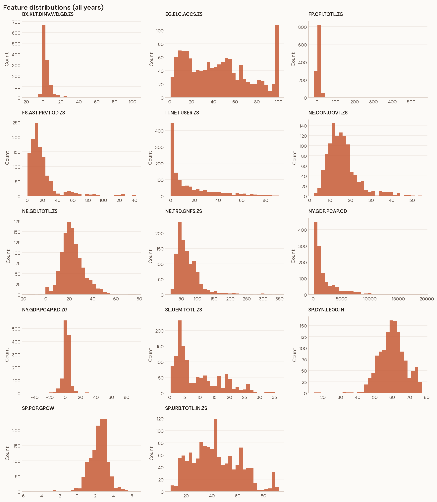
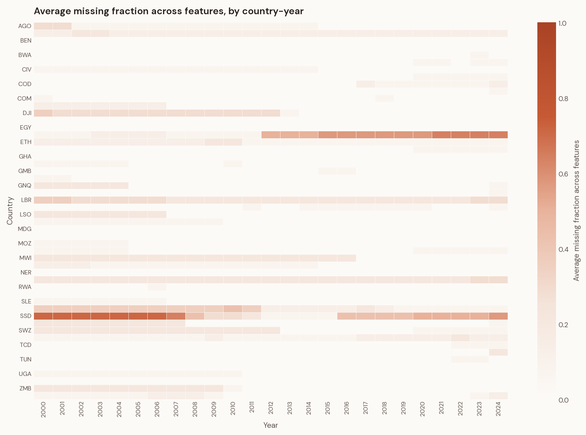
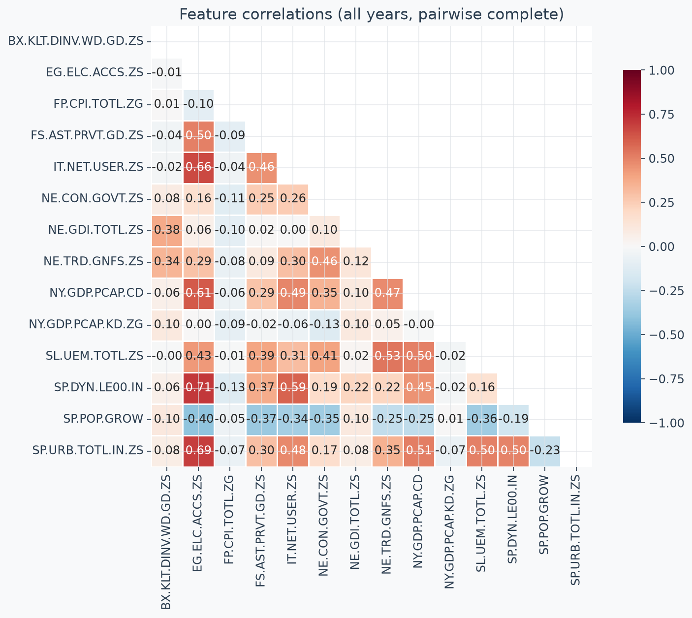
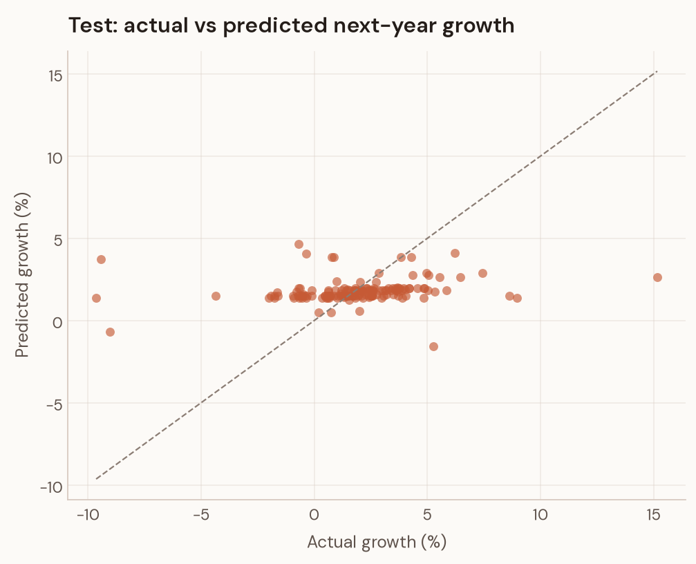
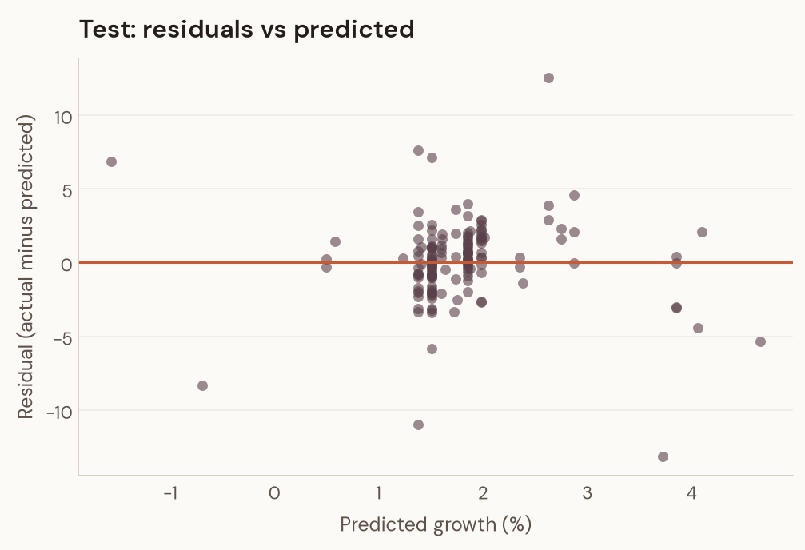
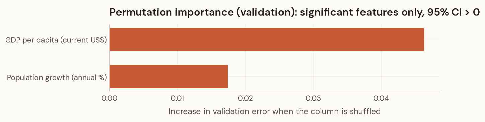

# Africa Growth Explorer: Capstone Report

**A Machine Learning Decision-Support System Using World Bank Development Indicators**

*Data Science Capstone · AnalystLab Internship*

> **On the numbers in this report.** Every figure is generated from committed
> model artifacts by `scripts/build_report_assets.py` and pasted from
> `reports/generated/`. `tests/test_report_assets.py` fails the build if any
> document quotes a metric the artifacts do not support. Nothing here is
> hand-computed. The model artifacts carry a provenance block —
> `models/model_metadata.json` records the creation timestamp, git commit,
> library versions, panel SHA-256, split sizes and target-year windows.

---

## 1. Introduction

Economic growth drives poverty reduction and living standards across Africa, and the analysts who allocate development capital need some way to compare countries against expected near-term performance. That is the motivation for this project.

The 54 UN African member states differ enormously in economic structure, resource endowment and development trajectory, but they share infrastructure gaps, human capital constraints and exposure to external shocks. A systematic cross-country comparison can surface patterns that single-country analysis misses.

A bare point prediction — "Ghana's 2024 growth will be 3.2%" — is not very useful on its own. What an analyst needs is the prediction, the indicators moving it, and how it shifts under alternative scenarios. That framing turns a static number into a tool, and it is why this project ships an interactive application rather than a table of forecasts.

The World Bank's World Development Indicators are the natural data source: comprehensive, standardised, cross-country comparable, and already monitored by the policy teams who would use this.

### The headline result, stated first

Fourteen WDI indicators observed at year *t* carry **no statistically significant information** about year *t+1* GDP per capita growth beyond the unconditional mean.

The deployed model reaches test MAE 1.82 against 1.90 for a predict-the-mean baseline. The paired 95% confidence interval on that improvement is [−0.04, +0.19], which includes zero. This is a null result, and it is the substantive finding of the project rather than a defect to be tuned away. Section 8 explains why it is robust and what it means; Section 12 explains why a null established under a rigorous protocol is worth more than a win established under a weak one.

---

## 2. Problem Statement

### The prediction task

Predict next-year GDP per capita growth (annual %) for African countries from development indicators observed in the current year.

- **Target variable:** GDP per capita growth, annual % (`NY.GDP.PCAP.KD.ZG`)
- **Horizon:** one year ahead — features at *t*, target at *t+1*
- **Worked example:** Ghana's 2019 indicators predict Ghana's 2020 growth

### Geographic scope

An explicit ISO3 list of the 54 UN African member states, plus Western Sahara for completeness, held in `config/indicators.yaml`. The list is explicit rather than derived from a region-name substring, which would sweep in non-African members of "Middle East & North Africa". The committed panel covers 52 of the 54 — see §3.

### Intended users

Development analysts, economic researchers, policy teams, NGOs and students.

### Expected impact

A screening tool for comparing development profiles against modelled growth expectations, with explicit extrapolation guardrails and a stated causal boundary. Given the null result, the honest description of what this delivers is a **falsification harness**: it demonstrates what a leakage-free protocol concludes about forecastable signal in annual WDI data. That is a different contribution from a validated forecaster, and the report does not conflate the two.

### Success criterion, fixed in advance

The model had to beat the global-mean, persistence and country-historical-mean baselines **on validation**, with the margin then tested for significance on a sealed test set. A model failing that bar does not ship — this is enforced in code, not by discipline (§4).

---

## 3. Dataset Description

### Source

World Bank **World Development Indicators**, downloaded as `WDI_CSV.zip` from [datatopics.worldbank.org/world-development-indicators](https://datatopics.worldbank.org/world-development-indicators/). The archive contains `WDICSV.csv` (data) and `WDICountry.csv` (metadata). Raw data is not committed (~30 MB); the processed panel is, with its SHA-256 recorded in model metadata.

### Panel shape

52 countries, 1,300 country-year rows, 2000–2024. After target construction 1,205 rows carry a usable next-year target.

> **Known coverage gap.** The committed panel predates the addition of
> Mauritius (MUS) and Sudan (SDN) to the country list, so it covers 52 of the
> 54 member states. The configuration and its tests already encode the full
> list; re-running `python -m src.data && python -m src.features` against a
> fresh `WDI_CSV.zip` produces the complete panel. Western Sahara is listed
> for completeness but WDI publishes no rows for it, so `src.data` logs it as
> missing from the data. This gap is stated rather than rounded away, and
> `tests/test_config.py` carries an `xfail` marking it as a known deviation.

### Indicators

Fourteen candidates across six themes. At panel-construction time the coverage filter examined 15 numeric columns — the 14 candidates plus the raw target column, retained as a current-year-growth feature. `SE.SEC.ENRR` fell below the 60% training-coverage threshold at 59.9% and was dropped, leaving **14 features**: 13 configured indicators plus current-year growth.

### Target construction

```python
target_next_year = panel.groupby("iso3")["NY.GDP.PCAP.KD.ZG"].shift(-1)
```

### Data limitations

- Training-row coverage ranges from 80.8% (government consumption) to 100% (life expectancy, urbanisation, population growth). FDI is 97.0% and domestic credit 87.8% — both among the better-covered series
- No forward-filling of volatile series such as inflation and FDI
- Median imputation happens inside the pipeline, fitted on training folds only
- Regional aggregates (SSF, AFE, AFW, income groups) are excluded by the sovereign-ISO3 list
- `src.data.check_duplicates` inspects `(iso3, year, indicator)` keys. Exact duplicates collapse; conflicting duplicates are logged at WARNING for investigation rather than silently dropped
- The 2020 COVID shock sits in the validation target window by design (§4)

---

## 4. Methodology

### Pipeline

1. Load raw WDI CSV in wide format
2. Filter to African countries via the explicit ISO3 list
3. Select the 14 candidate indicators plus the target code
4. Reshape wide to long and run the duplicate check
5. Pivot to a country-year panel and clean numeric placeholders
6. Create the next-year target via grouped shift
7. Coverage-based feature selection at ≥60%, computed on training rows only
8. Temporal train/validation/test split

### Splits — feature years and target years

Because the target is shifted forward one year, each split's targets sit one year later than its features. This distinction matters: conflating the two conceals a real bias mechanism, so the metadata records both.

| split | feature years | target years | n |
|---|---|---|---|
| train | 2000–2017 | 2001–2018 | 905 |
| val | 2018–2020 | 2019–2021 | 150 |
| test | 2021–2023 | 2022–2024 | 150 |

Validation targets include the 2020 COVID crash. Test targets are the post-pandemic recovery. That mismatch drives the refit decision below.

### Missing data

Features below 60% coverage on training rows are dropped. Rows with a missing target are dropped — this is the last feature year for each country. Remaining gaps are filled by median imputation **inside** the sklearn `Pipeline`, so imputation statistics are fitted on training folds only and never see validation or test data.

### Outliers

Extreme values — hyperinflation, commodity booms and busts, conflict-driven collapses — were inspected in `notebooks/01_data_profiling.ipynb` and retained as legitimate macroeconomic events. No winsorisation, no clipping. GDP per capita is log1p-transformed inside the pipeline.

### Baselines

Three, all computed without future information:

1. **Global mean** — predict the training-period mean for every observation
2. **Persistence** — predict next-year growth as this year's growth
3. **Country historical mean** — predict the country's expanding mean over all years ≤ *t*, falling back to the training global mean where a country has no history

### Models

**Ridge regression.** `SimpleImputer(median) → ColumnTransformer(log1p for GDPpc) → StandardScaler → Ridge(α)`, with α chosen by expanding-window CV over {1, 10, 100, 300, 1000, 3000}.

**HistGradientBoostingRegressor.** `SimpleImputer(median) → HGB`, with `early_stopping=True` set explicitly, `validation_fraction=0.15`, `n_iter_no_change=15`, `l2_regularization=1.0`, and a grid over `max_depth` {2, 3} × `learning_rate` {0.01, 0.03, 0.05} × `max_iter` {100, 200}.

> **Why early stopping is explicit.** sklearn's `early_stopping="auto"`
> disables itself below 10,000 samples. At n=905 an earlier configuration ran
> all 1,000 boosting rounds with no stopping criterion and overfit badly. Set
> explicitly, the deployed model stops at 45 of 200 iterations.

### Hyperparameter tuning

Expanding-window cross-validation with folds strictly inside the training period: train 2000–2010 → validate 2011–2012; train 2000–2012 → validate 2013–2014; train 2000–2014 → validate 2015–2016. Configurations are ranked by mean fold MAE with fold standard deviation as tiebreaker. Neither the validation nor the test split is visible to tuning.

### Refit policy, pre-registered

**The selected model is refit on training data only** (`refit_strategy = "train_only"`). This was decided before test data was read, on regime-mismatch grounds alone: validation targets span 2019–2021 including the COVID crash, while test targets span 2022–2024. Refitting on train+val bakes a depressed central tendency into a model that will be scored on a recovery period. The train+val variant is reported as sensitivity in §7 and was never a candidate for deployment.

### Selection gate

Before any artifact is written, the winner must beat **every validation baseline** on MAE. `enforce_baseline_gate` returns a pass/fail structure; on failure `finalize_model.py` exits non-zero and writes nothing. The only override is `--allow-baseline-failure`, which records the failure in metadata and obliges disclosure. This is what makes a worse-than-a-constant model unshippable by accident rather than by vigilance.

### Metrics

MAE in percentage points is primary. RMSE and R² are secondary. Directional accuracy is always reported next to the majority-class rate and directional skill, for reasons §7 makes concrete, and balanced directional accuracy is computed alongside. Additional diagnostics: metrics by year and country, worst errors, bootstrap confidence intervals, and a paired bootstrap significance test against the global-mean baseline.

### Test-set discipline

The test split is loaded, scored **once**, and never used for tuning, selection, refit choice or interpretation. Feature attribution is computed on validation. Notebooks load frozen predictions rather than recomputing them.

This is verifiable rather than merely asserted: corrupting the test-period outcomes and re-running the pipeline leaves the CV results, the selected winner and the gate outcome bit-identical, while test MAE moves from 1.82 to 51.40.

---

## 5. Exploratory Data Analysis

All figures are computed from the committed panel by the report-asset generator and re-executed in `notebooks/01_data_profiling.ipynb`.

### Target distribution

GDP per capita growth spans **−49.13 pp to +91.78 pp** across 1,255 observed country-years, with a median of 1.92 pp. **72.8% of observations are non-negative** — the origin of the majority-class rate that makes naive directional accuracy meaningless in §7.



**Figure 1.** Marginal distributions of all 14 candidate features plus the target. Three shapes matter. Inflation, FDI and GDP per capita are severely right-skewed with long single-sided tails — this is why GDP per capita enters the Ridge pipeline under a log1p transform, and why a scale-invariant tree model is the more natural fit. Electricity access and urbanisation are broad and near-uniform, carrying level information rather than change. The target is sharply peaked near 2 pp with tails in both directions: most country-years are unremarkable, and the variance a model would need to explain sits in a small number of extreme observations.

### Missingness

Coverage is not missing-at-random. The pattern is structural.



**Figure 2.** Average missing fraction by country-year. Gaps concentrate in specific country blocks — South Sudan before independence, Ethiopia from 2012, Djibouti and Liberia in the early 2000s — rather than spreading uniformly. Two consequences follow. Median imputation is defensible for scattered gaps but weakest exactly where gaps cluster, so those countries carry wider effective error. And because missingness is country-specific and persistent, a coverage filter computed on the full panel would leak test-period data availability into a training decision. The filter therefore runs on the training mask only.

### Summary statistics

| feature | n | min | median | max | train coverage % |
|---|---|---|---|---|---|
| NY.GDP.PCAP.CD | 1270 | 109.59 | 1060.83 | 19141.51 | 98.29 |
| EG.ELC.ACCS.ZS | 1284 | 0.80 | 42.65 | 100.00 | 98.29 |
| IT.NET.USER.ZS | 1263 | 0.01 | 7.14 | 91.20 | 97.76 |
| FP.CPI.TOTL.ZG | 1192 | -16.86 | 5.03 | 557.20 | 91.45 |
| NY.GDP.PCAP.KD.ZG (target) | 1255 | -49.13 | 1.92 | 91.78 | 96.69 |

Median electricity access is 42.65%, median internet penetration 7.14%, and maximum inflation 557.20% — the Zimbabwe hyperinflation episode. Full table in `reports/generated/table_eda_summary.md`.

### Trends

Mean growth fell across the panel's three macro regimes: **2.12 pp** over 2000–2010, **1.49 pp** over 2011–2019, and **0.67 pp** over 2020–2024. Median 2020 growth was **−3.51 pp**, with a median 2021–2022 recovery of **+1.92 pp**.

### Correlations

| pair | pearson r |
|---|---|
| EG.ELC.ACCS.ZS vs SP.DYN.LE00.IN | 0.71 |
| EG.ELC.ACCS.ZS vs SP.URB.TOTL.IN.ZS | 0.69 |
| EG.ELC.ACCS.ZS vs IT.NET.USER.ZS | 0.66 |
| NY.GDP.PCAP.CD vs EG.ELC.ACCS.ZS | 0.61 |



**Figure 3.** Pairwise complete correlations. The dense block in the upper left is the development-level cluster: electricity access, internet users, urbanisation, life expectancy and GDP per capita all correlate at 0.45–0.71. These are five measurements of substantially one latent variable, which is why permutation importance later assigns nearly all credit to a single member of the group (§8) rather than distributing it across five independent signals. The row that matters most is current-year growth, which is essentially uncorrelated with everything else (|r| ≤ 0.13). The most plausible persistence predictor of next-year growth has no linear relationship with any level indicator in the panel.

### What the EDA implies for modelling

1. Development levels are strongly collinear slow-moving variables. They describe where a country *is*, not how fast it is about to change.
2. Macroeconomic flows — inflation, FDI, growth itself — show weak bivariate association with next-year growth (|r| ≤ 0.1).
3. Together these foreshadow the modelling result. Cross-country level differences do not discriminate next-year growth once pooled, and the volatile series are noisy at annual frequency.

---

## 6. Model Development

### Pipelines

**Ridge.** `SimpleImputer(median) → ColumnTransformer(log1p GDPpc | passthrough) → StandardScaler → Ridge(α*)`. Coefficient extraction uses `get_transformed_feature_names` because the ColumnTransformer reorders columns — the log-transformed column moves to position 0, so pairing input names with `coef_` positionally would mislabel 9 of 14 coefficients.

**HGB.** `SimpleImputer(median) → HistGradientBoostingRegressor(max_depth*, learning_rate*, max_iter*, l2=1.0, early_stopping=True)`, with starred values from CV.

### Cross-validation results

The complete ranked grids are committed as `models/cv_results_ridge.csv` and `models/cv_results_hgb.csv`. Top rows:

| config | mean fold MAE | std | folds |
|---|---|---|---|
| HGB: max_depth=2, learning_rate=0.03, max_iter=200 | 3.21 | 0.75 | 3 |
| HGB: max_depth=2, learning_rate=0.03, max_iter=100 | 3.21 | 0.75 | 3 |
| HGB: max_depth=3, learning_rate=0.01, max_iter=100 | 3.22 | 0.76 | 3 |
| Ridge: alpha=3000 | 3.30 | 0.77 | 3 |
| Ridge: alpha=1000 | 3.35 | 0.79 | 3 |
| Ridge: alpha=300 | 3.46 | 0.83 | 3 |

Two things stand out. CV selects a heavily regularised tree at depth 2, and it pins Ridge at α=3000 — the largest value in the grid, meaning the linear model does best when shrunk hardest toward the mean. Both point the same way as the final result: additional capacity only buys overfitting.

### Reproducibility

`random_state=42` is fixed throughout. The pipeline, CV and bootstrap re-run deterministically — verified by comparing `model_metadata.json` across two independent runs, which differ only in timestamp and git commit. Provenance in metadata covers `created_utc`, `git_commit`, `library_versions` (Python 3.11.2, scikit-learn 1.9.0, pandas 2.3.3, numpy 1.26.4) and `panel_sha256`.

---

## 7. Evaluation Results

### Selection evidence and the gate

| Model | Split | MAE | RMSE | R2 | Dir. acc | Majority rate | Dir. skill |
|---|---|---|---|---|---|---|---|
| Global mean baseline | test | 1.90 | 2.84 | -0.00 | 0.81 | 0.81 | 0.00 |
| Persistence baseline | test | 2.23 | 4.52 | -1.54 | 0.77 | 0.81 | -0.03 |
| Country historical mean baseline | test | 1.94 | 2.88 | -0.03 | 0.78 | 0.81 | -0.03 |
| HistGradientBoostingRegressor (deployed) | test | 1.82 | 2.79 | 0.03 | 0.81 | 0.81 | 0.00 |
| Global mean baseline | validation | 4.04 | 6.14 | -0.18 | 0.51 | 0.51 | 0.00 |
| Persistence baseline | validation | 5.02 | 8.27 | -1.14 | 0.55 | 0.51 | 0.03 |
| Ridge (CV-best) | validation | 4.00 | 6.08 | -0.16 | 0.51 | 0.51 | 0.00 |
| HGB (CV-best) | validation | 3.89 | 5.97 | -0.11 | 0.53 | 0.51 | 0.01 |

Selection happened on validation, before any artifact was written: HGB at 3.89 beat the global-mean baseline at 4.04 by 3.75%, and persistence at 5.02 by 22.58%. Had it failed, the build would have exited 2 with no artifacts. Note that a 3.75% margin at n=150 is itself within noise — the null is already visible at the selection stage.

### Statistical significance

A paired bootstrap over test absolute-residual differences against the global-mean baseline, 5,000 resamples, seed 42:

> **Paired MAE improvement +0.07 pp, 95% CI [−0.04, +0.19]. The interval spans zero. Not significant at 95%.**

The model achieves parity with the unconditional mean, not victory over it. Put plainly: on genuinely held-out post-pandemic years, a tuned gradient-boosting ensemble over 14 WDI indicators cannot beat "predict 1.6%" once that mean is estimated from training data.

### Directional accuracy needs its denominator

80.67% of test targets are non-negative, so **any** always-positive predictor — the global-mean baseline included — scores 80.67% directional accuracy by construction. Placed next to the majority-class rate, the deployed model's directional **skill is 0.00 pp** and its balanced directional accuracy is 51.3%. There is no sign information beyond the class prior. Reporting the raw 80.7% alone would be misleading, which is why it never appears alone in this project.

### Fit quality on the test set (n=150)



**Figure 4.** Actual against predicted next-year growth on the sealed test set — the clearest single picture of the null result. Real signal would pull points toward the diagonal. Instead they form a horizontal band around 1.3–2.1 pp across an actual range spanning −10 pp to +15 pp. For the two country-years near −9 pp actual the model predicts roughly +1.4 and +3.7 pp; for the +15 pp observation it predicts +2.6 pp. This compression is not a tuning failure. It is what a correctly regularised model does when the features carry no conditional information, and it is preferable to a model that manufactures confident wrong answers at the tails.



**Figure 5.** Residuals against predicted values. The cloud centres on zero with no visible slope, confirming near-zero bias. Vertical spread runs to roughly ±5 pp for typical observations and beyond ±10 pp at the extremes — that is the honest error magnitude. Because predictions occupy such a narrow horizontal range, residual variance is driven almost entirely by variation in the actual outcome rather than by anything the model imposed.

**Mean residual: +0.08 pp.** Bootstrap 95% CIs over 2,000 resamples: MAE [1.52, 2.18], RMSE [2.16, 3.41]. Both intervals contain the corresponding global-mean baseline values, which is the same null result seen from another angle.

### Refit sensitivity

Refitting the selected model on train+val instead of train-only yields test MAE **2.03** with a mean bias of **−0.86 pp** — worse than the deployed model and systematically depressed, exactly as the pre-registered rationale predicted. The primary result uses train-only. This paragraph documents the counterfactual that was rejected in advance, not a result discovered afterwards.

### Performance by year

| feature year | MAE | RMSE | R2 | Dir. acc | Majority rate | Dir. skill |
|---|---|---|---|---|---|---|
| 2021 | 2.06 | 3.45 | 0.07 | 0.84 | 0.82 | 0.02 |
| 2022 | 1.85 | 2.76 | -0.08 | 0.78 | 0.80 | -0.02 |
| 2023 | 1.55 | 1.98 | 0.10 | 0.80 | 0.80 | 0.00 |

No year shows meaningful skill. R² oscillates around zero.

### Worst errors

| country | year | actual | predicted | abs error | context |
|---|---|---|---|---|---|
| Libya | 2021 | −9.42 | 3.72 | 13.15 | civil-war oil collapse |
| Cabo Verde | 2021 | +15.15 | 2.63 | 12.53 | tourism rebound off a −14.9% pandemic year |
| Equatorial Guinea | 2022 | −9.63 | 1.38 | 11.01 | hydrocarbon contraction |
| Seychelles | 2021 | −9.02 | −0.69 | 8.33 | tourism-dependent recovery |
| Libya | 2022 | +8.97 | 1.38 | 7.59 | oil-output volatility |

Every one is a conflict, oil or tourism shock in a small volatile economy — the class of event no lagged annual WDI snapshot anticipates. This is the mechanism behind the null, made concrete.

### Fair comparison

Test rows without a current-year growth value are dropped globally, so the model and the persistence baseline are scored on identical observations.

---

## 8. Interpretation

### Magnitude: permutation importance with confidence intervals

Computed on validation, never on the sealed test set.

| feature | name | mean | std | ci_lower | ci_upper | significant |
|---|---|---|---|---|---|---|
| NY.GDP.PCAP.CD | GDP per capita (current US$) | 0.046 | 0.016 | 0.018 | 0.085 | yes |
| SP.POP.GROW | Population growth (annual %) | 0.017 | 0.011 | 0.000 | 0.037 | yes |
| BX.KLT.DINV.WD.GD.ZS | Foreign direct investment (% of GDP) | 0.002 | 0.002 | -0.003 | 0.006 | noise |
| NY.GDP.PCAP.KD.ZG | GDP per capita growth, current year | 0.001 | 0.010 | -0.011 | 0.013 | noise |
| SP.URB.TOTL.IN.ZS | Urban population (% of total) | 0.000 | 0.002 | -0.002 | 0.003 | noise |
| FS.AST.PRVT.GD.ZS | Domestic credit to private sector (% of GDP) | 0.000 | 0.001 | -0.002 | 0.001 | noise |
| SP.DYN.LE00.IN | Life expectancy at birth (years) | 0.000 | 0.001 | -0.002 | 0.001 | noise |
| IT.NET.USER.ZS | Individuals using the Internet (%) | 0.000 | 0.000 | -0.001 | 0.001 | noise |
| FP.CPI.TOTL.ZG | Inflation, consumer prices (annual %) | 0.000 | 0.000 | -0.001 | 0.001 | noise |
| EG.ELC.ACCS.ZS | Access to electricity (%) | 0.000 | 0.000 | -0.000 | 0.001 | noise |
| NE.CON.GOVT.ZS | Government final consumption (% of GDP) | 0.000 | 0.000 | -0.000 | 0.001 | noise |
| NE.TRD.GNFS.ZS | Trade (% of GDP) | 0.000 | 0.000 | -0.001 | 0.001 | noise |
| NE.GDI.TOTL.ZS | Gross capital formation (% of GDP) | 0.000 | 0.000 | -0.001 | 0.001 | noise |
| SL.UEM.TOTL.ZS | Unemployment (% of labour force) | 0.000 | 0.001 | -0.001 | 0.001 | noise |

**Two of fourteen features are distinguishable from zero at 95%**, both tiny. Twelve have intervals straddling zero. There is no dominant predictor here, and no honest way to construct a narrative about growth drivers from this table.



**Figure 6.** The only two features whose importance has a 95% interval excluding zero. The other twelve are omitted deliberately: plotting noise invites over-reading. Note the axis scale — the larger effect is 0.046 in MAE-degradation units against a validation MAE near 3.9, roughly one percent. These are statistically detectable but economically negligible. GDP per capita's appearance is best read as the model latching onto the development-level cluster from Figure 3, not as evidence that income level drives next-year growth.

### Direction: Ridge standardised coefficients

Fitted on training data at the CV-selected α=3000.

| feature | name | coefficient |
|---|---|---|
| BX.KLT.DINV.WD.GD.ZS | Foreign direct investment (% of GDP) | 0.135 |
| SP.URB.TOTL.IN.ZS | Urban population (% of total) | -0.068 |
| NY.GDP.PCAP.CD_log1p | GDP per capita (log1p) | -0.068 |
| SP.POP.GROW | Population growth (annual %) | -0.050 |
| NE.GDI.TOTL.ZS | Gross capital formation (% of GDP) | 0.041 |
| EG.ELC.ACCS.ZS | Access to electricity (%) | 0.039 |

Every |coefficient| is ≤0.14 standardised units against a target with roughly 3.9 pp validation MAE. Even the linear association structure is faint, and the heaviest available shrinkage fits best. Direction here is association only: the negative GDP per capita coefficient reflects a conditional relationship within a small collinear feature set, and is not a claim that richer countries grow more slowly.

### Why this is a finding rather than a shrug

**It is robust.** The null appears on validation (a 3.75% gating margin at n=150, within noise), on test (paired CI spanning zero), under both model families, and across all three test target years.

**It is mechanistically intelligible.** WDI aggregates move slowly — they are levels, not flows. Next-year growth is dominated by events with no representation in the feature space, as every worst-error row in §7 demonstrates.

**It matches prior expectations** from the macro-forecasting literature for pooled annual cross-country panels of this size.

**The alternative is what a leaky protocol produces.** An earlier iteration of this same project reported a dominant electricity predictor and shipped a model materially worse than a constant, having selected its winner on the test set. Removing the leaks removed the apparent signal. A protocol that can find an effect but reports none is more credible than one that always finds something.

### Why importance is not causality

- **Confounding.** Electricity access correlates with institutional quality, geography and resource rents.
- **Reverse causality.** Growth funds infrastructure at least as readily as infrastructure drives growth.
- **Omitted variables.** Commodity prices, political stability, trading-partner growth and climate are all absent.
- **Measurement error.** WDI series are modelled estimates in low-capacity statistical systems; errors-in-variables attenuates associations.
- **Pooling.** One model across 52 economies imposes homogeneous slopes the data does not support.

The model is a conditional predictor. Scenario slider movements in the application are conditional prediction deltas, never counterfactual policy effects.

---

## 9. Decision-Support Application

A four-page Streamlit application, loading committed artifacts only — no retraining, no network calls.

1. **Project Overview** — problem, data, model card, headline metrics with the significance verdict, causal disclaimer
2. **Explore Africa** — country growth trends, indicator charts, regional comparison
3. **Model Performance** — significance banner, test and validation baseline tables, actual-vs-predicted, residuals, CI-gated importance with the noise table, Ridge direction panel, per-year metrics
4. **Scenario Explorer** — what-if analysis with training-window guardrails and one-at-a-time model deltas

**Guardrails.** Slider ranges and P1–P99 warning bands are computed on the training window only. Inflation's warning band tops out near 49.5 rather than the full-panel 92.1, so a user entering 80% inflation is correctly warned they have left the supported region. Out-of-band defaults are clamped, and the clamp is disclosed rather than silent.

**Attribution display.** Each row re-runs the deployed pipeline changing only that indicator, reported as an individual effect in percentage points, with a caption noting that effects need not sum because the model is nonlinear.

**Performance display.** Every directional figure appears with its majority-class rate and skill. The page opens with the paired-CI verdict rather than burying it.

---

## 10. Causal Limitations

Development indicators are endogenous. Electricity access, internet penetration and credit depth all correlate with governance quality and structural features the model cannot observe. Growth funds infrastructure at least as plausibly as infrastructure causes growth. Critical determinants — commodity prices, terms of trade, political stability, education quality, climate shocks, global financial conditions — are absent from the feature set. WDI figures are modelled estimates carrying non-trivial error in low-capacity statistical systems. And one pooled model imposes homogeneous relationships across 52 very different economies.

Moving a slider from 70% to 80% electricity access asks the model a specific question: what does it predict for a country-year profiled at 80%? The real world does not hold everything else constant while one indicator moves. That is a conditional prediction, not a counterfactual.

Establishing policy effects requires different tools: natural experiments and instrumental variables, difference-in-differences on policy rollouts, structural causal models with explicit DAGs, randomised trials where feasible, or synthetic control methods.

---

## 11. Recommendations

**For anyone using this tool**

1. **Do not allocate funding from these point predictions.** They are statistically indistinguishable from a constant. This is first because it is the recommendation with consequences.
2. **Use it for descriptive comparison** of development profiles via the Explore page. That is what the data supports.
3. **Treat every scenario delta as a model response**, never an intervention effect.

**For the next modelling cycle**

4. **Prioritise higher-frequency signal** — nightlights, port and air-traffic data, mobile-money flows, survey expectations — over additional annual WDI indicators. Parity argues for better inputs, not more models.
5. **Keep the baseline gate and the pre-registered protocol.** That machinery is the reusable asset from this project.
6. **Re-ingest WDI** to restore Mauritius and Sudan before quoting country coverage in any external document.
7. **Watch for regime breaks.** This null is partly a statement about a 25-year window containing three distinct macro regimes.

---

## 12. Conclusion

**What was built.** An end-to-end, leakage-controlled ML decision-support system: WDI ingestion with an explicit duplicate policy, coverage-gated feature engineering, temporal splits with explicit feature-and-target-year accounting, expanding-window hyperparameter tuning, a validation baseline gate, a single-read test protocol, provenance-stamped artifacts, an artifact-driven Streamlit application with training-window guardrails, executed notebooks, and a test suite of 86 tests that regression-guards the selection protocol itself.

**What the model achieved.** The strongest configuration found under a pre-registered search reaches test MAE **1.82** against **1.90** for the global-mean baseline, with a paired 95% CI of **[−0.04, +0.19]** on the improvement. Because that interval includes zero, the conclusion is that these 14 WDI indicators carry no statistically significant information about next-year GDP per capita growth beyond the unconditional mean.

**Why that counts as a result.** A null produced by a protocol that *could* have found an effect — and that, in an earlier and weaker form, was fooled into claiming one — is a genuine finding. It tells the reader that annual-frequency country-level WDI aggregates are too coarse and slow-moving for short-run growth forecasting, and it specifies what a serious next attempt would need: higher-frequency data, event-aware features, and per-country structure.

**How the application supports decisions.** By making the model's limits the first thing a user sees: the significance verdict, majority-rate-aware directional metrics, CI-gated importance, training-window extrapolation warnings, and scenario deltas labelled as model responses.

**Main limitations.** Temporal generalisation only; n=150 test observations; a COVID regime break adjacent to the test window; 52-of-54 country coverage; median imputation; multiple-comparison exposure from the CV grid.

**Future work.** Re-ingest WDI at the full 54-country list. Add higher-frequency indicators and event features such as commodity prices and political-instability indices. Ship prediction intervals in the application. Benchmark against a hierarchical or panel-econometric model — an AR panel with country fixed effects shrinking toward the mean is the obvious next competitor, and notably the tuned HGB essentially rediscovers that solution. Consider per-subregion models.

---

## 13. Threats to Validity

1. **Temporal generalisation only.** Countries are shared across splits, so this estimates "next years for known countries", not performance on unseen countries.
2. **Small test set.** At n=150 the confidence interval on the headline comparison is wide. A true 0.07 pp advantage cannot be resolved at this sample size — and neither can it be ruled out beyond the stated interval.
3. **Regime break.** Validation and test target regimes differ, COVID crash against post-pandemic recovery. The pre-registered refit policy addresses this, but a longer post-COVID window would be cleaner.
4. **Multiple comparisons.** Twelve CV configurations across two families were compared on validation, which inflates validation margins slightly. The paired bootstrap CI on the test metric is the number leaned on, and it spans zero.
5. **Median imputation** erases country-level missingness structure, and missingness is itself informative — conflict-affected states report less.
6. **Coverage gap.** The committed panel lacks Mauritius and Sudan. Conclusions are unchanged by construction because they are null, but the next re-ingestion should re-verify.
7. **WDI vintage instability.** Indicator definitions and historical values are revised over time. The panel is pinned by SHA-256, which guarantees *this* analysis is reproducible, not that a future download will match.

---

## Appendix: Key metrics

Regenerated from `models/model_metadata.json` via `python scripts/build_report_assets.py`.

```json
{
  "model_type": "HistGradientBoostingRegressor",
  "n_features": 14,
  "refit_strategy": "train_only",
  "gate": {"metric": "mae", "passed": true},
  "metrics": {
    "global_mean_baseline": {"mae": 1.8958, "rmse": 2.8379, "r2": -0.0005},
    "persistence_baseline": {"mae": 2.2287, "rmse": 4.5209, "r2": -1.5392},
    "country_historical_mean_baseline": {"mae": 1.9424, "rmse": 2.8816, "r2": -0.0316},
    "winner_test": {"mae": 1.8217, "rmse": 2.7942, "r2": 0.0300}
  },
  "significance": {
    "paired_mae_improvement_vs_global_mean": 0.074,
    "ci_lower": -0.0422,
    "ci_upper": 0.1868,
    "significant_at_95": false,
    "n_bootstrap": 5000
  }
}
```
